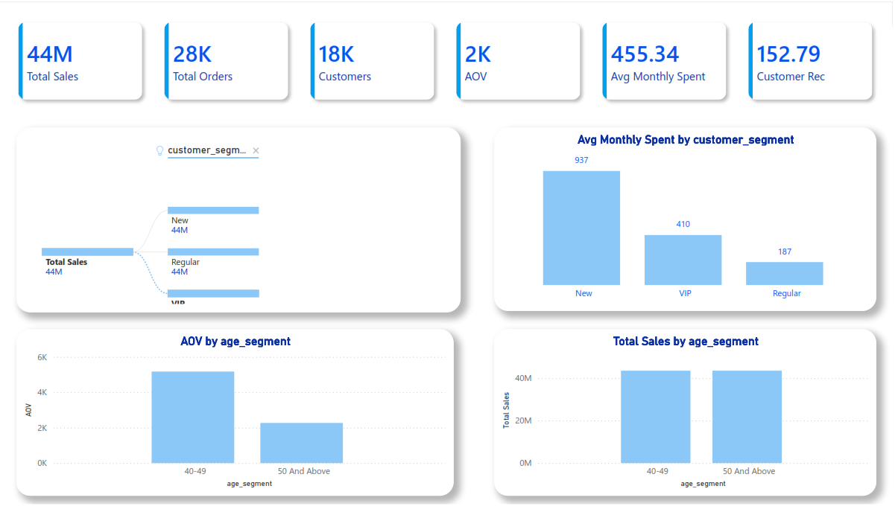
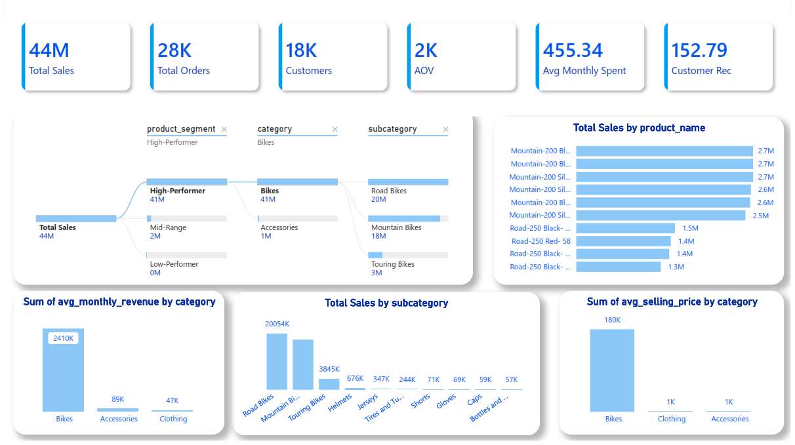

<p align="center">
  
</p>

# 📊 Sales, Customer & Product Insights Dashboard — Power BI

---

## 📘 Overview
This Power BI dashboard provides a complete analytical view of **Sales**, **Customers**, and **Products** using clean KPIs, segmentation, and interactive visuals.  
The report is built directly on top of the **Gold Layer** generated from the SQL Analytics Project.

🔗 **SQL Project Repository:**  
https://github.com/amirayman20/sql-data-analytics-project

This dashboard represents the final reporting layer of the analytics pipeline:  
**SQL EDA → Advanced Analytics → Gold Views → Power BI Reporting**

---

# 🏗️ Data Source
The dashboard uses the following SQL analytical views:

- `gold.report_sales`  
- `gold.report_customer`  
- `gold.report_products`  

These views include:
- Sales metrics  
- Customer segmentation & behavior  
- Product performance & categorization  
- Monthly revenue  
- Recency, frequency, monetary metrics  

---

# 📂 Folder Structure

```
powerbi-dashboard/
│── images/
│   ├── Home.png
│   ├── sales_overview.png
│   ├── customers_insights.png
│   └── products_performance.png
│
│── dashboard.pbix
│── README.md
```

---

# 📸 Dashboard Pages

---

# 🟦 1. Home Page
<p align="center">
  
</p>

A clean navigation page linking to:
- Sales Analysis  
- Customer Analysis  
- Product Analysis  

---

# 🟩 2. Sales Overview
<p align="center">
  
</p>

### ⭐ KPIs
- **44M** Total Sales  
- **28K** Total Orders  
- **18K** Customers  
- **2K** Average Order Value  
- **455.34** Avg Monthly Spent  
- **152.79** Customer Recency  

### 📊 Visuals
- Sales by Category  
- Sales by Subcategory  
- Top Products by Sales  
- Product Performance Tree  

### 🔍 Insights
- Bikes dominate total sales.  
- Road & Mountain Bikes lead subcategory performance.  
- A few products generate most of the revenue.  

---

# 🟧 3. Customer Insights
<p align="center">
  
</p>

### ⭐ KPIs
- Customer Recency  
- Average Monthly Spend  
- Total Customers  
- Total Orders  

### 📊 Visuals
- Customer segmentation  
- Spending behavior  
- Recency distribution  
- Customer performance metrics  

### 🔍 Insights
- High‑recency customers contribute significantly to revenue.  
- Loyal customer groups show strong monthly spending.  

---

# 🟪 4. Product Performance
<p align="center">
  
</p>

### ⭐ KPIs
- Total Sales  
- Total Orders  
- Total Customers  
- Average Selling Price  
- Average Monthly Revenue  

### 📊 Visuals
- Product Performance Tree  
- Top Products by Sales  
- Avg Monthly Revenue by Category  
- Avg Selling Price by Category  

### 🔍 Insights
- High‑Performer products generate most sales.  
- Bikes lead in revenue and pricing.  
- Accessories & Clothing provide stable secondary revenue.  

---

# 🔗 Related Projects
### **SQL Data Analytics Project (Source of Gold Layer)**  
https://github.com/amirayman20/sql-data-analytics-project

---

# 🛠️ Tools Used
- SQL Server  
- Power BI Desktop  
- DAX  
- GitHub  

---

# ▶️ How to Use
1. Open `dashboard.pbix`  
2. Connect to SQL Gold Layer  
3. Refresh the model  
4. Explore the dashboard  

---

# 🇸🇦 النسخة العربية

## 📘 نظرة عامة
لوحة Power BI تعرض تحليلات شاملة للمبيعات والعملاء والمنتجات باستخدام KPIs وVisuals تفاعلية.  
الداشبورد مبني على **طبقة Gold** الناتجة من مشروع SQL.

🔗 **رابط مشروع SQL:**  
https://github.com/amirayman20/sql-data-analytics-project

---

## 🟩 صفحة المبيعات
- إجمالي المبيعات  
- إجمالي الطلبات  
- أفضل المنتجات  
- المبيعات حسب الفئات  

## 🟧 صفحة العملاء
- Recency  
- الإنفاق الشهري  
- عدد العملاء  
- سلوك العملاء  

## 🟪 صفحة المنتجات
- أداء المنتجات  
- متوسط سعر البيع  
- الإيراد الشهري  
- شجرة المنتجات  

---

# 📬 Connect With Me

<p align="center">

  <a href="https://www.linkedin.com/in/amir-ayman-664513103/" target="_blank">
    
  </a>

  <a href="https://github.com/amirayman20" target="_blank">
    
  </a>

  <a href="mailto:amirayman20@gmail.com">
    
  </a>

</p>

